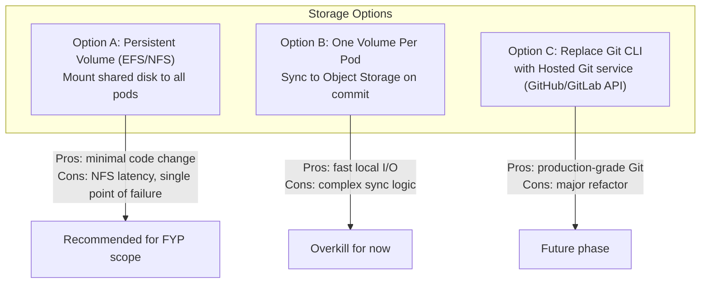
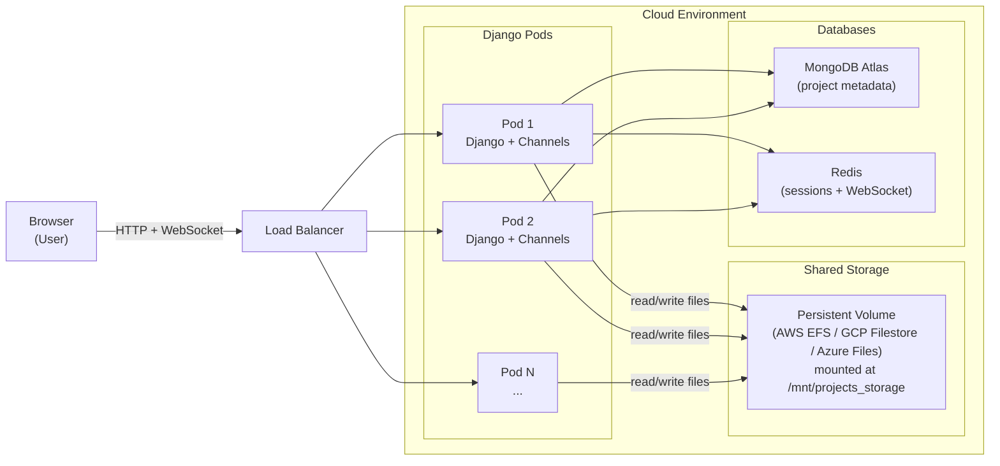
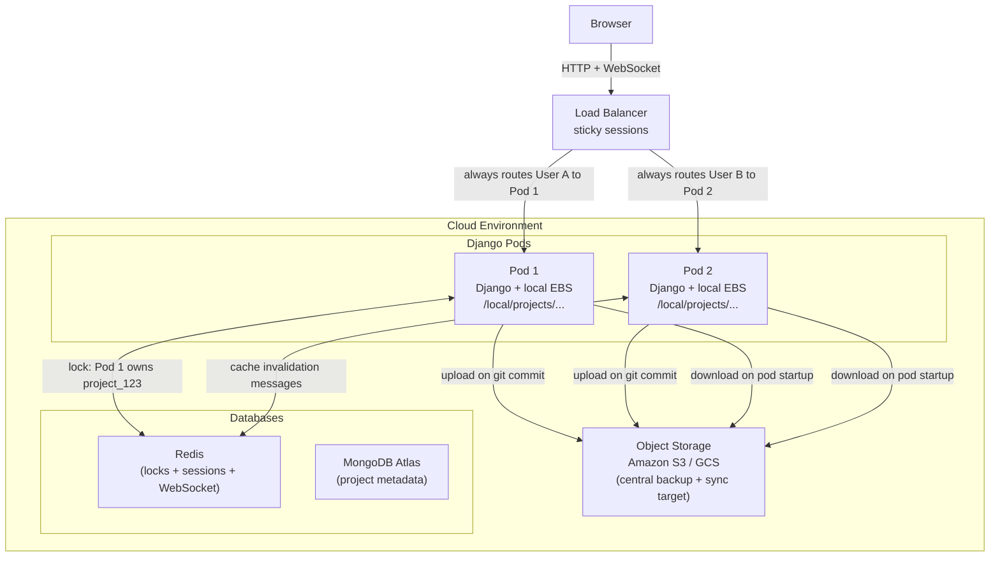
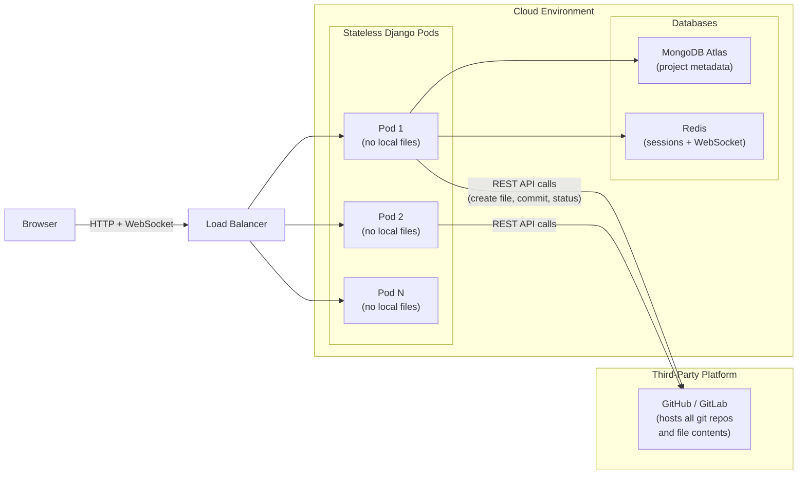

# Cloud Storage Strategy for `projects_storage`

## Current State (Problems for Cloud)

The current design stores every project on the **local Django process filesystem**:

```
sagile_ide_backend/sagile_ide/projects_storage/
└── <MongoDB ObjectId>/      ← one folder per project
    ├── .git/                ← full local Git repo
    ├── *.ystate             ← Yjs CRDT binary state
    └── <project files>
```

Key problems:

- Path is **hardcoded** as `BASE_DIR / 'projects_storage'` in two places: `[repositories/views.py](sagile_ide_backend/sagile_ide/repositories/views.py)` and `[projects/views.py](sagile_ide_backend/sagile_ide/projects/views.py)`
- Files live on the **same machine** as the Django process — won't survive container restarts or horizontal scaling
- **No per-user filesystem isolation** — all project folders are siblings under one root
- **In-memory Channel Layer** (WebSocket) dies with the process and can't serve multiple instances
- **SQLite sessions** can't be shared across instances

---

## Architecture Decision: What Kind of Storage?

The main tension is the **Git integration**. All git operations (`git init`, `git status`, `git log`, `git commit`) are run as subprocesses via `subprocess.run(..., cwd=repo_path)`. They require a **real POSIX filesystem** with an actual `.git/` directory.

This rules out pure object storage (S3/GCS) as a direct drop-in.




**Recommendation for this project: Option A** — mount a network-attached persistent volume (e.g., AWS EFS, GCP Filestore, or Azure Files) at the `projects_storage` path. Minimal code change, supports multiple containers reading/writing the same files.

---

## Option A Deep Dive: Persistent Shared Volume (EFS / NFS)

### The Core Idea

A **persistent shared volume** is a network-attached disk that is mounted into every container at the same path. From the Django process's point of view, it looks and behaves exactly like a normal local folder — `os.makedirs`, `open()`, `subprocess.run(['git', ...], cwd=path)` all work unchanged. The only difference is that the folder physically lives on a remote storage server, not on the container's own disk.




### How Mounting Works in Practice

When the application is deployed (e.g., on Kubernetes or AWS ECS), you declare the volume once and attach it to every pod/task:

```yaml
# Kubernetes example (simplified)
volumes:
  - name: projects-storage
    persistentVolumeClaim:
      claimName: efs-pvc          # points to an AWS EFS-backed PVC

containers:
  - name: django
    image: sagile-ide-backend
    volumeMounts:
      - name: projects-storage
        mountPath: /mnt/projects_storage   # ← same path on every pod
    env:
      - name: PROJECTS_STORAGE_PATH
        value: /mnt/projects_storage
```

Every pod sees the exact same directory tree at `/mnt/projects_storage`. When Pod 1 creates a file, Pod 2 immediately sees it — no syncing required.

### Why This Works for Our Git Integration

Our backend runs git as CLI subprocesses:

```python
subprocess.run(['git', 'init'], cwd=repo_path)
subprocess.run(['git', 'commit', '-m', msg], cwd=repo_path)
```

These commands need a real POSIX filesystem with a `.git/` directory. AWS EFS and GCP Filestore are **NFS-based** — they fully support POSIX semantics (file locks, directory operations, executable bits), so git works transparently without any code changes.

### Why This Works for Yjs / CRDT State

Each file has a companion `.ystate` binary alongside it (e.g., `index.js` + `index.js.ystate`). The `EditorConsumer` WebSocket handler reads and writes these on every collaborative edit. Since all pods mount the same volume, any pod can pick up a WebSocket connection and read the latest `.ystate` for that file.

However, **the Redis Channel Layer is still required**: when two users are editing the same file, their WebSocket connections may land on different pods. Redis acts as the message bus so that the Yjs update from Pod 1 is forwarded to Pod 2 and broadcast to the other user. The shared volume handles persistence; Redis handles real-time fanout.

### Concurrency and Locking Considerations

NFS does not provide the same strong locking guarantees as a local disk. For this project, the risk is low because:

- Each project directory is isolated — two users editing the same project are the most common conflict scenario, and Yjs handles that at the application layer.
- Git operations (`git commit`, `git status`) are short-lived and per-project, so concurrent git calls on different projects don't interfere.
- The one risk is **two users triggering a `git commit` on the same project simultaneously**. A simple file-based lock (Python's `fcntl.flock`) or a Redis-based distributed lock on `(project_id, "git")` would mitigate this.

### Costs and Trade-offs


| Aspect        | Detail                                                                                                  |
| ------------- | ------------------------------------------------------------------------------------------------------- |
| Latency       | ~1–3ms extra per file I/O vs local SSD. Acceptable for a code editor; not noticeable to users           |
| Throughput    | EFS scales to GB/s; GCP Filestore is configurable. More than enough for an IDE                          |
| Availability  | Managed services (EFS, Filestore) are multi-AZ redundant — higher availability than a single local disk |
| Cost          | More expensive than a single EBS volume but necessary once you have more than one pod                   |
| Simplicity    | **Lowest code change of all options** — no storage library changes, no S3 SDK, no Git hosting API       |
| Single Region | NFS volumes are regional; cross-region replication requires additional backup tooling                   |


### Step-by-Step Provisioning (AWS Example)

1. **Create an EFS filesystem** in the same VPC as your ECS/EKS cluster, with mount targets in each availability zone.
2. **Create a StorageClass + PersistentVolumeClaim** (Kubernetes) or an EFS volume mount (ECS task definition).
3. **Set the env var** `PROJECTS_STORAGE_PATH=/mnt/projects_storage` in your container definition.
4. **Update `settings.py`** to read `PROJECTS_STORAGE_PATH` from the environment (see Changes Required below).
5. **Copy existing data** from the local `projects_storage/` to EFS once during migration: `aws s3 sync` or `rsync` over SSH.
6. **Update MongoDB** `Repository.root_path` values to reflect the new mount path.

> **Not familiar with AWS, Kubernetes, EFS, NFS, or pods?**
> A full beginner-friendly walkthrough of all these concepts — including diagrams, plain-English definitions, and a step-by-step AWS setup guide — is available in [option_a_explained.md](option_a_explained.md).

---

## Option B Deep Dive: Per-Pod Volume with Object Storage Sync

### The Core Idea

Instead of all pods sharing one network disk, each pod gets its **own fast local disk** (e.g., AWS EBS — a standard cloud SSD). Files are worked on locally at full disk speed. A sync layer pushes project files to an **object storage bucket** (e.g., Amazon S3) at key checkpoints — primarily after every `git commit`. When a new pod starts and a user requests a project, it downloads the files from S3 onto its local disk before serving.




### Why Each Pod Needs Its Own Local Disk

Object storage (S3) cannot serve as a live working directory. You cannot run `git init` or `open()` against an S3 URL — it is not a POSIX filesystem. Each pod must have a real local disk for git and file I/O to work. S3 is only used as the **synchronisation and backup layer** between pods, not as the live working directory.

### Key Problems This Introduces

**1. Session Stickiness**
Because files live locally on a specific pod, a user must always be routed to the same pod throughout their session. The load balancer must use sticky sessions (pin a user to a pod). This reduces load-balancing effectiveness.

**2. Pod Warm-Up Latency**
When Kubernetes scales up by adding a new pod, that pod's disk is empty. The first request for any project triggers an S3 download before the request can be served. This adds latency on first access per project, per pod.

**3. Write Conflict / Split-Brain Risk**
If two pods have the same project checked out locally and both write to it before syncing, one pod's upload to S3 will silently overwrite the other's — **data loss**. Preventing this requires a distributed lock (Redis-based) that grants only one pod write ownership of a project at a time.

**4. Significant New Code Required**
Option B requires building from scratch:

- An S3 sync service (upload/download project trees)
- A Redis-based distributed project lock
- A pod startup warm-up hook
- A post-commit S3 upload trigger
- Cache invalidation messages between pods
- Stale local file eviction to reclaim disk space

None of this exists in the current codebase. Compare to Option A where the only code change is a single settings variable.

### Costs and Trade-offs


| Aspect                 | Detail                                                             |
| ---------------------- | ------------------------------------------------------------------ |
| File I/O speed         | Near-zero overhead — local SSD                                     |
| Pod startup time       | Slow — must download from S3 before serving first request          |
| Code changes needed    | High — sync engine, locking, warm-up, eviction all need building   |
| Concurrent edit safety | Requires explicit distributed locking; not automatic               |
| Sticky sessions        | Required — adds operational complexity                             |
| Storage cost           | Cheaper (S3 is far cheaper per GB than EFS)                        |
| Operational complexity | High                                                               |
| Good for FYP scope     | No — too much extra engineering for marginal benefit at this scale |


### When Option B Becomes Worth It

Option B is the right choice when:

- You have hundreds of pods where NFS latency becomes measurable under load
- Projects are gigabytes in size and NFS throughput is a bottleneck
- You need geo-distributed deployments where a single NFS region is too slow for remote regions
- You have engineering capacity to build and maintain the sync infrastructure

For SAgile IDE at FYP scale, Option A's ~1–3ms NFS overhead is imperceptible and Option B's engineering cost is not justified.

> **Not familiar with object storage, EBS, sticky sessions, or distributed locks?**
> A full beginner-friendly walkthrough of all these concepts — including diagrams, the split-brain problem, code examples, and a detailed comparison with Option A — is available in [option_b_explained.md](option_b_explained.md).

---

## Option C Deep Dive: Replace Local Git with a Hosted Git Service API

### The Core Idea

Instead of running `git` as a local CLI subprocess on files stored on disk, every git operation becomes an **HTTPS API call** to a hosted Git platform (GitHub or GitLab). The Django backend holds no project files on its own disk at all. Every pod is fully stateless — any pod can handle any request because the source of truth is entirely on GitHub/GitLab's servers.



### What Each Git Operation Becomes

Every current `subprocess.run(['git', ...])` call must be replaced with one or more HTTPS API calls:

| Current (local CLI) | Option C (API equivalent) |
|---|---|
| `git init` | `POST /user/repos` — create a new GitHub repo |
| Write file to disk | `PUT /repos/{owner}/{repo}/contents/{path}` |
| Read file from disk | `GET /repos/{owner}/{repo}/contents/{path}` |
| `git add . && git commit` | Upload each file as a blob + create tree + create commit object + update branch ref (5+ calls) |
| `git status` | Compare known file SHAs against latest commit tree |
| `git log` | `GET /repos/{owner}/{repo}/commits` |

### Key Problems This Introduces

**1. API Rate Limits**
GitHub enforces 5,000 authenticated requests per hour per token. A real-time editor that auto-saves every 2 seconds across 5 open files generates ~2,500 requests/hour per user. With 10 concurrent users the limit is hit in minutes. This is a fundamental mismatch between an IDE's I/O pattern and what a hosting API was designed for.

**2. Latency Per File Operation**
Every file read or write is now an HTTPS round trip to GitHub's servers (~50–200ms). Current disk reads take under 1ms. In a collaborative editor this latency is immediately noticeable.

**3. Multi-File Atomic Commits Are Complex**
A single `git commit` covering many changed files requires 5+ sequential API calls (get tree SHA → upload blobs → create tree → create commit → update ref). This is significantly more brittle than `git add . && git commit`.

**4. OAuth Infrastructure Required**
Each user needs their own GitHub/GitLab account. SAgile IDE must implement a full OAuth 2.0 flow (redirect to GitHub, handle callback, store and refresh tokens, handle revocation). This does not exist today and is substantial new infrastructure.

**5. Third-Party Dependency**
If GitHub has an outage, SAgile IDE cannot read or write any project files. Options A and B have no such dependency.

**6. Real-Time Editing Conflict**
The Yjs `.ystate` CRDT files that power collaborative editing must also live somewhere. The GitHub API is not designed for the write frequency of a keystroke-level real-time editor. A secondary storage (S3 or in-memory) would still be needed for `.ystate`, meaning Option C does not actually eliminate all local storage concerns.

### Costs and Trade-offs

| Aspect | Detail |
|---|---|
| Pod statefulness | Fully stateless — the cleanest architecture |
| File I/O speed | 50–200ms per operation (HTTPS to GitHub) |
| Rate limits | 5,000 req/hr per user — incompatible with real-time auto-save |
| Code changes needed | Near-complete rewrite of repositories app and file management |
| Real-time editing | Problematic — API not designed for keystroke-frequency writes |
| OAuth complexity | Full GitHub OAuth flow must be built |
| Third-party dependency | Yes — GitHub/GitLab uptime directly affects availability |
| User requirement | Every user must have a GitHub/GitLab account |
| Good for FYP scope | No — near-rewrite with fundamental API incompatibilities |

### A Viable Middle Ground: Optional GitHub Mirror

Option C does not have to be all-or-nothing. A practical future enhancement is:

- Keep Option A (NFS shared volume) as the primary storage with local `.git/` repos
- Add an **optional "Push to GitHub" feature**: after a commit in SAgile IDE, also push to a user's linked GitHub repository as a remote mirror
- Users who want GitHub visibility can opt in; those who do not are unaffected

This captures most of Option C's value (GitHub history, pull requests, external visibility) without its fundamental drawbacks.

### When Option C Makes Sense

Option C is the right primary architecture only when the product is explicitly a **GitHub/GitLab integration tool** (like github.dev, Gitpod, or GitHub Codespaces) where users are expected to already have accounts and the product's value proposition is built on top of the hosting platform's features. SAgile IDE is a self-contained platform; coupling its core file I/O to a third-party API rate limit is not appropriate.

> **Not familiar with REST APIs, GitHub OAuth, rate limits, or the Git Data API?**
> A full beginner-friendly walkthrough of all these concepts — including what the API calls actually look like, why rate limits are a hard blocker, and a full comparison across all three options — is available in [option_c_explained.md](option_c_explained.md).

---

## Proposed Storage Layout (with per-user isolation)

Currently there is **no user-scoped directory**. For multi-user cloud deployments, add a user layer:

```
projects_storage/
└── <user_id>/                 ← new: per-user namespace
    └── <project_id>/
        ├── .git/
        └── <project files>
```

This improves auditability, makes per-user quotas/backups possible, and reduces the blast radius if a path-traversal bug occurs.

---

## Changes Required

### 1. Centralise the storage path into a setting

- Add `PROJECTS_STORAGE_PATH` to `settings.py`, defaulting to `BASE_DIR / 'projects_storage'` for local dev
- In cloud, set via environment variable (e.g., `/mnt/efs/projects_storage`)
- Update the two hardcoded occurrences in `[repositories/views.py](sagile_ide_backend/sagile_ide/repositories/views.py)` and `[projects/views.py](sagile_ide_backend/sagile_ide/projects/views.py)`

### 2. Add per-user directory prefix

- Change path from `<storage_root>/<project_id>` to `<storage_root>/<user_id>/<project_id>`
- Update `repository.root_path` to include the user segment
- Migrate existing `root_path` values in MongoDB if needed

### 3. Switch Channel Layer to Redis (required for multi-instance WebSocket)

- Currently: `InMemoryChannelLayer` (single process only)
- Replace with `channels_redis` pointing to a managed Redis instance
- This is **mandatory** before any horizontal scaling; without it, users on different pods can't collaborate in real time

### 4. Switch sessions to Redis or DB (required for multi-instance login)

- Currently: Django SQLite sessions (local file)
- Use `django-redis` session backend or `django.contrib.sessions.backends.db` pointed at a shared Postgres/MongoDB store

### 5. Secrets and config via environment variables

- `SECRET_KEY`, MongoDB URI, Redis URI, `PROJECTS_STORAGE_PATH` — all must be env vars, not hardcoded

---

## Summary of Dependencies

- Persistent shared filesystem (AWS EFS / GCP Filestore / Azure Files) — for project files and `.git/` repos
- Redis — for Channel Layer (WebSocket) and sessions
- MongoDB with auth enabled — already used, just needs credentials via env vars
- Object Storage (S3/GCS) — optional, useful for backups or large asset uploads in a later phase

---

## What Does NOT Need to Change

- The `git` subprocess approach works fine as long as the path is on a mounted filesystem
- The `pycrdt` / `.ystate` per-file CRDT state works fine on a shared volume
- MongoEngine domain models (Projects, Repositories, Tasks) are already cloud-ready
- The membership-based API authorization layer is sufficient; filesystem-level ACLs are not required

